# Training Sqlite and Room

## I. Db và Sqlite trong Android
### 1. Các loại database cho Android
**SQLite**: là một cơ sở dữ liệu quan hệ, mã nguồn mở, nó được tích hợp sẵn trên hệ điều hành Android, vì vậy bạn có thể sử dụng nó bất cứ lúc nào, và không cần phải cấu hình gì thêm.

**Realeam database**: là một cơ sở dữ liệu nhẹ, có thể thay thế cả hai thư viện SQLite và ORM trong các ứng dụng Android. Realm không sử dụng SQLite làm engine của nó. Thay vào đó, nó dùng core C++ nhằm mục đích cung cấp một thư viện cơ sở dữ liệu thay thế SQLite.

**Room**: được phát triển và cải tiến từ sqlite. Room database giúp đơn giản hoá việc code,và giảm thiểu các công đoạn liên quan đến cơ sở dữ liệu. Nó là một abstract layer cung cấp cách thức truy câp thao tác với dữ liệu trong cơ sở dữ liệu SQLite
## 2. Sqlite
SQLite là hệ quản trị cơ sở dữ liệu quan hệ (Relational database management system – RDBMS). 

SQLite có những điểm mạnh sau:

- Mã nguồn mở
- Tuân theo quy chuẩn về cơ sở dữ liệu
- Kích thước nhẹ
- Cấu trúc đơn tầng

Nó được cài đặt như một thư viện nhỏ gọn và là một phần trong bộ phần mềm Android. Ngoài ra, SQLite cung cấp các chức năng như thông qua một thư viện.
 Mỗi cơ sở dữ liệu sẽ trở thành một phần được tích hợp trong ứng dụng. Điều này giúp làm giảm sự phụ thuộc vào bên ngoài, tối thiểu độ trễ và đơn giản hóa các giao dịch và đồng bộ.
SQLite nổi tiếng là cơ sở dữ liệu cực kỳ đáng tin cậy và là sự lựa chọn cho nhiều thiết bị điện tự bao gồm máy nghe nhạc MP3, Iphone, iPod về hệ thống cơ sở dữ liệu.

Tool xem, sửa, ... csdl sqlite

https://sqlitebrowser.org/

## II. Các thao tác Add, update, remove row với DB
### 1. Tạo một lớp tiện ích để làm việc với cơ sở dữ liệu SQLite, lớp này nên mở rộng từ lớp SQLiteOpenHelper.
Có 2 phương thức quan trọng mà bạn cần phải ghi đè (override) nó là **onCreate()** và **onUpgrade()**.

**onCreate()** - Những là nơi mà chúng ta cần phải viết để tạo bảng. Nó được gọi (called) khi cơ sở dữ liệu được tạo ra.

**onUpgrade()** - Phương thức này được gọi khi cơ sở dữ liệu được nâng cấp như thay đổi cấu trúc bảng, thêm giàng buộc cho cơ sở dữ liệu, v..v.

## 2. Các thao tác cơ bản
### a. Add

-  Sử dụng ContentValues - class dùng để lưu list các giá trị theo key - value,theo  HashMap

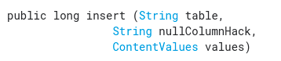

- **table**: tên bảng

- **nullColumnHack**: tên của cột
Nói cho hệ thống biết sẽ làm gì trong trường hợp ContentValues trống. 

Nếu để tên cột: sẽ thêm 1 hàng vào và cột đó được set giá trị null

Nếu truyền null: sẽ không  insert hàng khi không có giá trị nào

- **values**: biến content values, nơi ta truyền dữ liệu vào bảng
Ví dụ
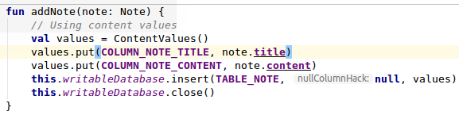

### b. Update

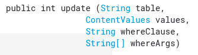

- **table**: tên của bảng
- **values**: content values, lưu tên cột - giá trị muốn update
- **whereClause**: điều kiện WHERE, điều kiện để update dữ liệu
- **whereArgs**: tham số cho điều kiện WHERE
==> Trả về số dòng bị ảnh hưởng
### Ví dụ

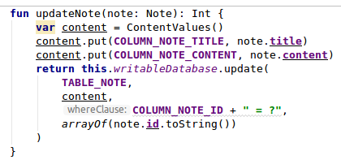

### c. Remove

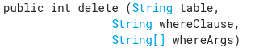

- **table**: tên của bảng

- **whereClause**: điều kiện WHERE, điều kiện để update dữ liệu

- **whereArgs**: tham số cho điều kiện WHERE

==> Trả về số dòng bị ảnh hưởng

### Ví dụ

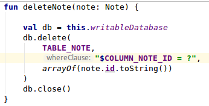

### d. Query

Để đọc dữ liệu từ database, ta sử dụng query(), kết quả sẽ trả về dưới dạng Cursor

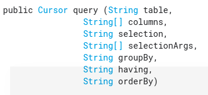

- **table**: tên bảng

- **colums**: tên các cột muốn trả về, null để lấy tất cả các cột

- **selection**: câu lệnh sql để 

- **groupBy**: câu lệnh để group các dòng, tạo bởi câu lệnh SQL GROUP BY

- **having**: câu lệnh để filter các dòng, tạo bởi câu lệnh SQL HAVING

- **orderBy**: sắp xếp các dòng, tạo bởi câu lệnh SQL ORDER 

## III. Room vs SQLite vs Migrate SQLite
### 1. Room là gì ?
### a. Định nghĩa

- Room được phát triển và cải tiến từ sqlite. Room là một ORM - Object Relational Mapping. Room database giúp đơn giản hoá việc code,và giảm thiểu các công đoạn liên quan đến cơ sở dữ liệu. Nó là một abstract layer cung cấp cách thức truy câp thao tác với dữ liệu trong cơ sở dữ liệu SQLite

### b. Room vs SQLite
- SQLite không có verification cho raw SQL query ở thời điểm complie. Ví dụ nếu viết câu lệnh SQL với tên cột không tồn tại trong bảng, nó sẽ báo lỗi trong run time chứ không phải ở complie. Điều này sẽ làm tốn thời gian code hơn

- Khi cấu trúc bảng thay đổi, vs SQLite sẽ phải update câu lệnh querry bằng tay. Điều này sẽ tốn thời gian và dễ gây lỗi

- Cần rất nhiều code để convert giữa SQL queries và Java data object: tên cột, tên bảng, tên database, các câu lệnh về con trỏ, các câu query... => Tốn thời gian

- Room được build để làm việc với LiveData và Rx, còn SQLite thì không

### c. Thành phần

 ### 3 thành phần chính

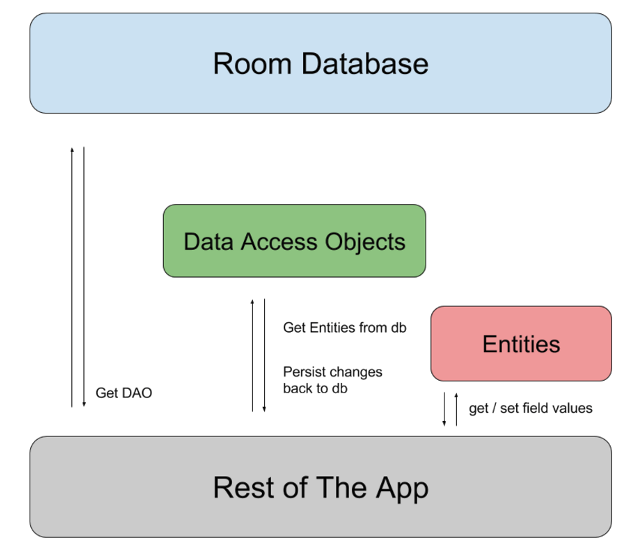

### - Database:

chứa database holder và phục vụ như một điểm truy cập chính tới dữ liệu của app

- **Entity**: đại diện cho bảng trong csdl

- **DAO (Data Access Object)**: chứa các phương thức để truy cập tới dữ liệu 

### d. Chi tiết

Demo:

https://github.com/trungcnn-1883/Training-Room

### Entity: 

- Sử dụng anotation @Entity, tạo ra bảng tương ứng trong CSDL

- @PrimaryKey: định nghĩa khóa chính, nếu cần id tự động tăng thì dùng autoGenerate = true

- @ColumnInfo(name = "comlunm_name"): để định nghĩa tên cột, nếu không sẽ tự động lấy theo tên biến

- @Ignore: nếu không muốn tạo vào bảng thì dùng

- Có thể đánh Index, tạo Unique thông qua thuộc tính indices, set unique = true

- Tạo quan hệ giữa các bảng thông qua biến foreignKeys

**DAO (Data Access Objects)**: định nghĩa các phương thức để truy cập tới CSDL

- Sử dụng anotation @Dao

- Khi build thì code logic sẽ được sinh ra

- Các phương thức chính: @Query, @Update, @Insert, @Delete

**Database**: điểm truy cập chính tới csdl
- Sử dụng anotation @Database
- Định nghĩa danh sách các thực thể và các DAO của csdl

Tại  runtime, có thể lấy instance của  Database bằng cách gọi  Room.databaseBuilder() hoặc Room.inMemoryDatabaseBuilder().

- **databaseBuilder**: database sẽ được tạo trong /data/data/com.your.app và sẽ được lưu lại. Dùng cho bản prodution

- **inMemoryDatabaseBuilder**: sẽ được tạo trong bộ nhớ hệ thống, nếu kill app thì database sẽ bị xóa đi, data sẽ không được lưu lại. Thường dùng để test

### Về allowMainThreadQueries
Room không hỗ trợ truy cập database trên main thread chỉ khi dùng **allowMainThreadQueries**. Bởi vì có thể nó sẽ lock UI trong thời gian dài, gây ra lỗi ANR. 
Query bất đồng bộ (Asynchronous queries), query trả về instance của LiveData hoặc Flowable sẽ khắc phục được điều này.

Vs **sqlite** cũng có thể làm bất đồng bộ như sử dụng AsynTask, Handler, Thread,  CursorLoader, ...

### 2. Migration với Room

### a. So sánh vs Sqlite

Việc migration trên API SQLite thực hiện sẽ rất khó khăn và không cẩn thận một chút là đã tự hủy đi database của người dùng trong ứng dụng.


Việc phải cập nhật database với các phiên bản sau sẽ xảy ra 2 trường hợp sau:

Nếu người dùng cài đặt ứng dụng mà chưa có version 1 thì ứng dụng sẽ chạy vào phương thức DbHelper.onCreate(db).


Nếu người dùng cập nhật từ phiên bản version 1 lên 2 thì ứng dụng sẽ chạy vào phương thức DbHelper.onUpgrade(db… ).


Việc đầu tiên cần làm để cập nhật database lên phiên bản mới nhất là viết lệnh SQL để đưa các cơ sở dữ liệu lên phiên bản mới nhất(đối với các máy chưa có version nào).
Khi đã tạo được câu lệnh để cập nhật, phải dựa vào database trong hàm onUpgrade() để lấy dữ liệu cũ ra và cập nhật vào bảng mới nếu có thêm cột mới:


Việc cập nhật đối với từng phiên bản sẽ được triển khai thủ công bên trong hàm onUpgrade() để đảm bảo người dùng có database mới nhất đối với sự thay đổi version tiếp theo

### b. Xử lý của Room

Trong Room, nếu có sự thay đổi về cấu trúc, thư viện sẽ gợi ý bạn tăng version của database lên ở trong cài đặt cấu hình của database. Nếu giữ nguyên version của database, room sẽ không hoạt động, không thực hiện được các câu lệnh

Nếu như thay đổi version nhưng lại không có migration cho version 1 lên 2, lúc này room cũng sẽ không hoạt động, không thực hiện được các câu lệnh.
. Lúc này hệ thống sẽ hiển thị thông báo cho bạn sử dụng phương thức **fallbackToDestructiveMigration()** để thay đổi hẳn database mới.

Nhưng nếu làm theo thì database sẽ bị xóa hoàn toàn và không còn dữ liệu người dùng. Vì vậy chúng ta phải tìm cách để vừa cập nhật ứng dụng lại vừa có thể giữ lại được database cũ.


Để giữ nguyên dữ liệu của người dùng, chúng ta cần tạo ra một migration giữa các phiên bản. Nếu schema không có sự thay đổi gì, chúng ta chỉ cần tạo ra một migration trống, lúc này dữ liệu sẽ được dữ lại:

Đổi version lên 2

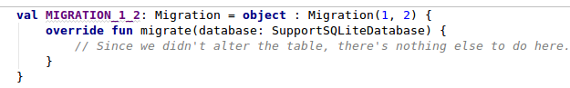


Trong trường hợp migration với schema thay đổi ít, sẽ phải dùng một số lệnh của SQL như ALTER để thay đổi tên hoặc thêm cột mới.

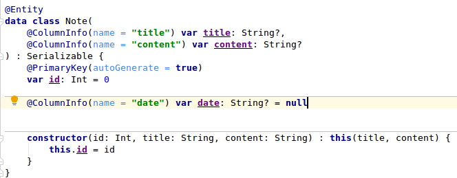

Thêm trường date

Đổi version lên 3

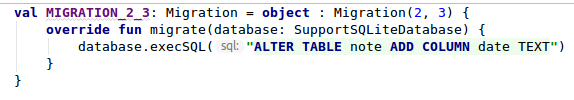

Nếu thay đổi những cấu trúc phức tạp của schema, bạn cần thao tác thêm việc copy từ bảng cũ sang bảng mới bằng lệnh SQL được viết trong migration:
Việc cập nhật theo từng phiên bản diễn ra theo trình tự trên, nhưng Room cũng hỗ trợ việc migration nhiều version lại với nhau, ví dụ ở đây chúng ta thực hiện việc migration từ version 1 tới 4 bằng tổng hợp một migration chung cho nhiều thay đổi như sau:

```
database = Room.databaseBuilder(context.getApplicationContext(),
        UsersDatabase.class, "Sample.db")
        .addMigrations(MIGRATION_1_2, MIGRATION_2_3, MIGRATION_3_4, MIGRATION_1_4)
        .build();
```

### 3. Room và RxJava/RxKotlin
### a. Lợi ích

- Chạy bất đồng bộ, tránh block UI thread

- Tự động update dữ liệu trên UI khi dữ liệu thay đổi

### b. Code 
- Với insert

Khi kết hợp Room và Rxjava cho phép các kiểu trả về tương ứng sau khi ta thực hiện thao tác Insert

```
@Insert
Completable insert(User user);
// or
@Insert
Maybe<Long> insert(User user);
// or
@Insert
Single<Long> insert(User[] user);
// or
@Insert
Maybe<List<Long>> insert(User[] user);
// or
@Insert
Single<List<Long>> insert(User[] user);
```

Completable : onComplete được gọi khi quá trình Insert được thực hiện xong

Single<Long> or Maybe<Long> : Sẽ trả về row id của item được insert tại phương onSuccess khi item đó Insert thánh công

Single<List<Long>> or Maybe<List<Long>>  : Sẽ trả về danh sách row id của các item được insert tại phương onSuccess khi list item đó insert thành công

Đối với các trường hợp error khi Insert thì Completable, Single và Maybe sẽ trả về exception tại phương thức onError

### - Với update/delete
Update/Delete

Vậy với các thao tác Update/Delete thì chúng ta sẽ làm như thế nào để kết hợp Room và Rxjva ??

Cũng giống như Insert ta có 2 lựa chọn để sử dụng đó là :Completable và Single

```
@Update
Completable update(User user);
// or
@Update
Single<Integer> update(User user);
// or
@Update
Single<Integer> updateAll(User[] user);
// or
@Delete
Single<Integer> deleteAll(User[] user);
// or
@Delete
Single<Integer> deleteAll(User[] user);
```

Completable : Phương thức onComplete sẽ được gọi khi query update/delete được thực hiện thành công

Single<Integer> or Maybe<Integer> : Khi query của chúng ta thành công số hàng đã được update/delete sẽ trả về tại phương thức onSuccess.

### - Với query: có sự khác biệt lớn giữa Flowable, Maybe, Single

### Flowable

- Nếu không có data, dữ liệu sẽ không được phát ra, cũng ko gọi vào onNext, onError

- Có data thì sẽ vào onNext

- Và giờ nếu thêm data mới hoặc update dữ liệu thì Flowable sẽ phát dữ liệu ra để cho UI update dữ liệu

###==> Dữ liệu được update

### Maybe

- Nếu không có data trong csdl và query trả về không hàng nào thì Maybe sẽ được complete

- Nếu có data thì sẽ vào onSuccess và sẽ được complete

Và giờ nếu thêm data mới hoặc update dữ liệu thì chẳng có gì sẽ xảy ra cả. Maybe đã được complete 

###==> Dữ liệu sẽ không được thêm hoặc cập nhật


### Single

- Nếu không có data nào ở trong csdl và query trả về không hàng nào ==> Sẽ vào onError

- Nếu có data thì sẽ vào onSuccess

Và giờ nếu Single được kết thúc, việc thêm data mới hoặc update dữ liệu sẽ không xảy ra

###==> Dữ liệu sẽ không được thêm hoặc cập nhật

### 4. Room và Time 

Nếu bạn có nhu cầu phải lưu trữ và truy xuất một số loại ngày giờ. Room không cung cấp cho bạn bất kì hỗ trợ nào, nhưng thay vào đó lại cung cấp annotation @TypeConverter để map giữa những đối tượng phức tạp về dạng mà Room có thể hiểu được và ngược lại.

Dưới đây sử dụng class Converters để có thể convert time ở dạng Long về Date và ngược lại:
```
class Converters {
    @TypeConverter
    fun fromTimestamp(value: Long?): Date? {
        return value?.let { Date(it) }
    }

    @TypeConverter
    fun dateToTimestamp(date: Date?): Long? {
        return date?.time?.toLong()
    }
}
```
Sau đó khai báo các lớp Converter cần thiết vào trong Database Room lúc khởi tạo:

```
@Database(entities = arrayOf(User::class), version = 1)
@TypeConverters(TimeConverters::class)
abstract class AppDatabase : RoomDatabase() {
}
```

Bây giờ bạn có thể sử dụng đối tượng Date như là một đối tượng được Room hiểu được:

```
@Entity
data class User(private var birthday: Date?)
```

Lấy ra các đối tượng thỏa mãn điều kiện Date tương tự như với kiểu dữ liệu bình thường như sau:

```
@Dao
interface UserDao {
    @Query("SELECT * FROM user WHERE birthday BETWEEN :from AND :to")
    fun findUsersBornBetweenDates(from: Date, to: Date): List<User>
}
```

-----------------------------------------------------------------------------------------------------------------------

## Transaction

### 1. Limit transaction của sqlite

- Về việc insert dữ liệu

Không có giới hạn thực tế về số lần insert trên mỗi giao dịch. 

Nó phụ thuộc vào dung lượng bộ nhớ, tốc độ xử lý của phần cứng, ...

Việc insert có thể tới hàng trăm nghìn dòng, nhưng vẫn có thể hoạt động tốt

Người tạo ra SQLite, D.Richard Hipp thậm chí còn gợi ý mở transaction khi chương trình bắt đầu, làm tất cả mọi việc trong thời gian dài, và chỉ commit khi thoát hoặc muốn lưu lại trạng thái.

SQlite có thể dễ dàng insert 50000 hoặc hơn dòng dữ liệu mỗi giây trên một máy tính trung bình. Nhưng chỉ có thể thực hiện một vài tá transaction mỗi giây. Tốc độ giao dịch bị giới hạn bởi tốc độ quay của ổ đĩa của bạn

Tốc độ giao dịch bị giới hạn bởi tốc độ ổ đĩa vì (theo mặc định) SQLite thực sự đợi cho đến khi dữ liệu thực sự được lưu trữ an toàn trên bề mặt đĩa trước khi giao dịch hoàn tất. Bằng cách đó, nếu bạn đột nhiên mất điện hoặc nếu hệ điều hành của bạn gặp sự cố, dữ liệu của bạn vẫn an toàn

----------------------
Tham khảo: câu 19

https://www.sqlite.org/faq.html

----------------------

### 2. Tìm hiểu về transaction của SQLite

Transaction trong SQLite là một đơn vị công việc được thực hiện bởi một Database. Transaction là đơn vị hoặc dãy công việc được thực hiện theo một thứ tự logic và hợp lý, có thể được thao tác bởi người dùng hoặc bởi một Database program.

Thực tế, bạn sẽ tập hợp nhiều truy vấn SQLite vào trong một nhóm và sẽ thực thi tất cả truy vấn này cùng với nhau như là một phần của một transaction.

Điều khiển Transaction trong SQLite
Trong SQLite, có các lệnh sau được sử dụng để điều khiển transaction:

BEGIN TRANSACTION: Để bắt đầu một Transaction.

COMMIT: để lưu thay đổi, bạn thể sử dụng lệnh END TRANSACTION để thay thế.

ROLLBACK: để quay trở lại trạng thái trước khi có thay đổi.

### 3. Các cách thức để tối ưu câu lệnh truy vấn, nâng cao perfomance của tương tác với SQLite

- Chỉ lấy ra dữ liệu cần thiết: cần thông tin nào thì lấy ra thông tin đó, lọc những thông tin cần thiết

- Giới hạn kết quả trả về: chỉ lấy vs số lượng cần cho việc xử lý

- Không làm cho truy vấn phức tạp hơn mức cần thiết, tối ưu câu lệnh truy vấn

- Ràng buộc điều kiện một cách hợp lý

Nâng cao performance tương tác vs Sqlite: dùng transaction

Theo bài viết sau: https://medium.com/@JasonWyatt/squeezing-performance-from-sqlite-insertions-971aff98eef2

### Mỗi câu lệnh tương tác vs db thì chúng sẽ đều dk tạo 1 transaction

db.insert(): tự tạo transaction sẽ làm giảm số transaction sẽ tạo để truy suất đến db

Việc sử dụng transaction cho insert có thể làm cho tăng tốc độ lên hơn 10 lần :D 

db.execSQL(): có thể dùng câu lệnh câu lệnh sql insert thay cho hàm insert, việc này cũng giúp bớt đi được thời gian insert

Ngoài ra có thể dùng SQLiteStatement , batch, giúp cho tốc độ tăng lên rất nhiều lần

Việc sử dụng transaction cần phải hiểu ý nghĩa và không nên lạm dụng.

### 4. Tìm hiểu thêm về việc nhiều luồng cùng thực hiện truy vấn hoặc cùng thực hiện việc thay đổi database

Việc cùng thực hiện thay đổi, truy vấn database sẽ khiến dữ liệu không được chính xác, đưa ra kết quả sai, có thể gây ra hậu quả lớn

Có nhiều giải pháp như cơ chế đồng bộ, lock, deadlock, ...

SQL Server nói riêng và các database quan hệ nói chung là dạng database có độ nhất quán dữ liệu cao nhất. Dữ liệu trong database luôn ở dạng consistency tại mọi thời điểm. Nghĩa là với cùng một dữ liệu thì không thể có việc đọc ghi tại cùng một thời điểm. Việc đọc ghi cùng một dữ liệu sẽ dẫn tới hiện tượng lock lẫn nhau để đảm bảo dữ liệu được consistency.

Lệnh Select sẽ xung đột với các lệnh Update, Insert, Delete. Vì các lệnh Update, Insert, Delete làm thay đổi dữ liệu của một table do đó tại một thời điểm nếu thực hiện lệnh select thì sẽ không thể insert, update, delete trên cùng một table hoặc ngược lại. Điều này rất quan trọng, vì nếu không lock dữ liệu thì sẽ dẫn tới việc đọc dữ liệu ra sai so với thực tế.

Các lệnh Insert, Update, Delete lock theo row không lock theo table. Nghĩa là có thể thực hiện đồng thời các lệnh đó trên cùng một table miễn là chúng không tranh chấp nhau cùng một row dữ liệu. Lock để đảm bảo tính consistency data là một trong các ưu điểm nổi bật của cơ sở dữ liệu quan hệ.

Có các cơ chế lock, deadlock


